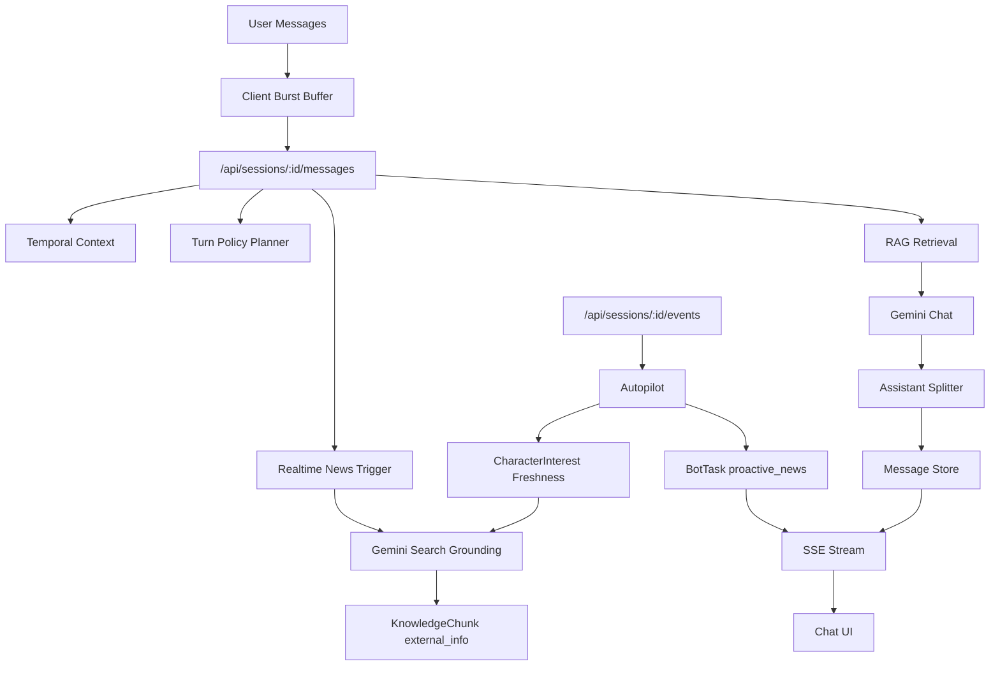

# CharacterChat

CharacterChat은 “캐릭터가 살아 있는 것처럼 느껴지는” 1:1 AI 캐릭터 채팅 서비스입니다. 단순히 프롬프트로 성격을 흉내 내는 챗봇이 아니라, 캐릭터의 생활 리듬, 관계 기억, 관심사, 최신 정보, 대화 공백을 함께 다루는 캐릭터 운영 엔진을 목표로 합니다.

현재 구현은 Next.js 16, Prisma, PostgreSQL/Neon, pgvector, Gemini 기반입니다.

## Product Thesis

AI 캐릭터 채팅의 핵심 경쟁력은 모델 성능 하나가 아니라 “계속 만나고 싶은 존재감”입니다. CharacterChat은 다음 질문에서 출발합니다.

- 캐릭터가 늘 대기 중인 봇처럼 보이지 않게 할 수 있는가?
- 어제와 오늘, 밤과 낮, 평일과 주말의 대화 감각이 달라질 수 있는가?
- 사용자가 여러 메시지를 짧게 보내도 사람처럼 맥락을 묶어 받을 수 있는가?
- 캐릭터가 관심 있는 뉴스나 트렌드를 알고 먼저 말을 걸 수 있는가?
- 캐릭터 설정을 수작업으로 하나씩 입력하지 않고, 비정형 자료에서 자동 구축할 수 있는가?

이 프로젝트는 위 질문을 서비스 구조로 풀어내는 실험입니다.

## Core Experience

- 유저는 캐릭터와 카카오톡에 가까운 1:1 대화 경험을 한다.
- 캐릭터는 고정된 말투뿐 아니라 현재 시간, 생활 상태, 관계 기억을 반영한다.
- 짧은 메시지 여러 개는 burst로 묶여 한 턴의 의도로 처리된다.
- assistant 응답은 하나의 긴 문장이 아니라 여러 자연스러운 말풍선으로 분리된다.
- 채팅 화면이 열려 있으면 SSE를 통해 캐릭터가 먼저 말을 걸 수 있다.
- 캐릭터 관심사와 관련된 최신 이슈가 나오면 실시간 검색 후 지식으로 저장하고 대화에 반영한다.

## Current Characters

기존 캐릭터는 모두 새 구조에 맞춰 `PersonaCore`, 생활 리듬, 관심사 데이터를 보강했습니다.

| Character | Profile | Realtime Interests |
|---|---|---|
| 미라 | 동거 중인 20세 연인, 대학생 감성, 장난스러운 반말 | 대학생 트렌드, 자취 요리, 서울 데이트, 편의점 신상, ENFP 밈 |
| 도유한 | 한남동 위스키바 헤드 바텐더, 절제된 존댓말 | 위스키 신제품, 칵테일 바 트렌드, 한남동 바, 도쿄 바, 바텐더 대회 |
| 한이린 | 전 국가대표 후보 수영선수, 현 수영 코치 | 한국 수영, 국제 수영대회, 수영 훈련, 스포츠 재활, 생활체육 수영 |
| 임하늘 | 대학생, 편의점/카페 알바, 임용 준비 | 임용고시, 대학생 생활비, 편의점 야식, 카페 알바, 캠퍼스 축제 |
| 윤서지 | 출판 편집자, 단편소설 작가, 조용한 존댓말 | 출판계 뉴스, 신간 소설, 문학상, 서울국제도서전, 독립서점 |

## Architecture



## Key Systems

### 1. Temporal Life Rhythm

캐릭터는 한국 시간 기준 또는 캐릭터별 시간대 기준의 큰 생활 흐름을 가집니다.

- weekday/weekend timeline
- sleep, waking, work, meal, personal, free, late_night 상태
- 마지막 대화 이후 공백 판단
- 같은 장면 유지, 부드러운 재진입, 새 장면 전환
- 긴 공백 발생 시 episode memory rollup

주요 파일:

- `src/lib/temporal/timeline.ts`
- `src/lib/policy/planner.ts`
- `src/lib/gemini/prompt.ts`

### 2. Memory Rollup

대화가 길어지거나 시간이 많이 비면 모든 턴을 그대로 들고 가지 않고, episode memory와 relation summary로 정리합니다.

- `KnowledgeChunk(type="episode")`: 지난 대화 장면 요약
- `KnowledgeChunk(type="relation_summary")`: 유저와 캐릭터 관계 변화 요약
- `PersonaState.relationSummary`: 빠른 관계 상태 참조
- pgvector embedding 기반 검색

주요 파일:

- `src/lib/memory/episode.ts`
- `src/lib/memory/relation.ts`
- `src/lib/rag/retrieve.ts`

### 3. Multi-message Conversation Flow

유저가 짧게 여러 번 보내는 실제 채팅 습관을 반영합니다.

- 클라이언트 burst buffer가 짧은 메시지를 잠시 모은다.
- 서버는 합쳐진 입력을 한 턴의 의도로 처리한다.
- LLM 응답은 `splitAssistantMessage()`로 여러 말풍선처럼 나뉜다.
- SSE 이벤트는 `message_start`, `message_delta`, `message_done`, `done` 구조로 흐른다.

주요 파일:

- `src/components/chat/ChatShell.tsx`
- `src/lib/conversation/assistantSplit.ts`
- `src/app/api/sessions/[id]/messages/route.ts`

### 4. Realtime Interest and News

캐릭터는 관심사를 갖고, 관심사 정보는 최신성을 가집니다.

- `CharacterInterest`: 캐릭터별 관심사와 freshness 설정
- `KnowledgeChunk(type="external_info")`: 최신 외부 정보 저장
- `KnowledgeChunkMetadata`: source URL, confidence, topic, expiry 등 별도 메타데이터
- 유저가 뉴스성 발화를 하면 즉시 검색
- 채팅 화면 SSE heartbeat 중 관심사가 오래됐으면 자동 검색 및 선발화 task 생성

주요 파일:

- `src/lib/news/realtime.ts`
- `src/lib/news/autopilot.ts`
- `src/app/api/sessions/[id]/events/route.ts`
- `src/app/api/admin/characters/[id]/news/refresh/route.ts`

### 5. Character Extraction

비정형 자료에서 캐릭터를 자동 구축합니다.

입력 형태:

- 텍스트 업로드
- URL
- 기존 DB의 `KnowledgeDoc`

처리:

- Gemini 3.1 Pro가 캐릭터 구조를 JSON으로 추출
- `Character`, `CharacterConfig`, `PersonaCore`, `KnowledgeDoc`, `CharacterInterest` 생성
- 누락된 필드와 추정한 필드를 별도로 반환

주요 파일:

- `src/lib/characters/extract.ts`
- `src/lib/characters/persist.ts`
- `src/app/api/admin/characters/extract/route.ts`

## Data Model Highlights

주요 Prisma 모델:

- `Character`: 캐릭터 기본 정보
- `CharacterConfig`: 모델/온도/첫 인사/상태 패널 설정
- `PersonaCore`: 캐릭터의 정체성, 성격, 말투, 외형, 기본 관계값
- `PersonaState`: 유저별 관계 상태와 상태창 payload
- `CharacterInterest`: 관심사, 검색어, freshness
- `KnowledgeDoc`: 원문 자료
- `KnowledgeChunk`: RAG 단위 지식, episode, relation summary, external info
- `KnowledgeChunkMetadata`: 별도 메타 테이블
- `Session`: 유저와 캐릭터의 1:1 세션
- `Message`: 메시지와 이미지 asset 연결
- `BotTask`: 선발화, lookup 후속 대화, proactive event task

## Tech Stack

- Framework: Next.js 16, React, TypeScript
- Styling: Tailwind CSS, lucide-react
- Auth: NextAuth v5 beta
- Database: PostgreSQL on Neon
- ORM: Prisma
- Vector Search: pgvector
- LLM: Gemini chat/pro/search grounding
- Embedding: `text-embedding-004`
- Storage: Vercel Blob
- Streaming: Server-Sent Events

## API Surface

Chat:

- `GET /api/sessions/[id]/messages`
- `POST /api/sessions/[id]/messages`
- `GET /api/sessions/[id]/events`

Character operations:

- `POST /api/admin/characters/extract`
- `GET/POST /api/admin/characters/[id]/interests`
- `POST /api/admin/characters/[id]/news/refresh`
- `GET/POST /api/admin/characters/[id]/knowledge`
- `GET/POST /api/admin/characters/[id]/persona`

Admin/caster:

- `POST /api/admin/caster/runs`
- `POST /api/admin/caster/runs/[id]/messages`
- `POST /api/admin/caster/runs/[id]/commit`

## Setup

```bash
npm install
cp .env.example .env
npx prisma db push
npx tsx scripts/seed-character-interests.ts
npm run dev
```

Required environment variables:

```bash
DATABASE_URL=
AUTH_SECRET=
AUTH_GOOGLE_ID=
AUTH_GOOGLE_SECRET=
GOOGLE_GENAI_API_KEY=
GOOGLE_GENAI_API_KEY_FALLBACK=
BLOB_READ_WRITE_TOKEN=
ADMIN_EMAILS=
```

## Scripts

```bash
npm run dev
npm run build
npm run typecheck
npm run db:generate
npm run db:migrate
npm run db:deploy
npm run db:studio
npm run db:seed
npx tsx scripts/seed-character-interests.ts
```

## Current Status

Implemented:

- Character chat runtime
- PersonaCore/PersonaState architecture
- RAG with pgvector
- temporal timeline and scene continuity
- episode memory rollup
- relation summary rollup
- burst input handling
- assistant response splitting
- SSE proactive message channel
- BotTask queue
- realtime news trigger
- character interest freshness
- automatic interest inference fallback
- character extraction from unstructured text/URL/DB docs

Known technical note:

- This project is still pre-production. The DB was aligned with `prisma db push` during rapid schema iteration. Before production launch, migration history should be normalized and replay-tested against a clean database.

## Roadmap

Near-term:

- In-app admin screens for inspecting interests, realtime knowledge, and BotTask history
- safer background worker deployment for proactive events outside open SSE sessions
- richer character extraction review workflow
- source quality scoring for realtime news
- scheduled daily/weekly interest refresh in addition to conversation-triggered lookup

Longer-term:

- multi-character rooms
- character-to-character events
- monetized premium personas
- creator tools for imported character packs
- observability dashboard for retention, message quality, and memory health

## Philosophy

The service should not feel like a form wrapped around an LLM. It should feel like a relationship surface.

That means the system values continuity over one-off completion, mood over raw verbosity, timing over instant availability, and memory over transcript dumping. The product direction is to make characters feel less like “always-on assistants” and more like people with their own rhythm, interests, and imperfect but convincing presence.
